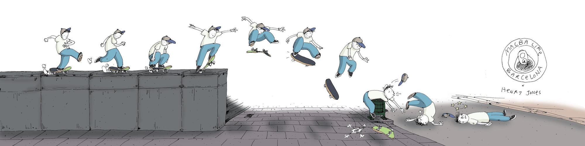

<head><title> life crash </title></head>

<link rel="stylesheet" type="text/css" href="https://jsndyks.github.io/web/css/pages.css"/>

## LIFE CRASH

When I was thinking about what has happened to me over the last few months, the term ‘**Life Crash**’ seemed to describe it pretty well.

I _Googled_ it, to see whether anybody else had ever had one, and not much came up ... other than [a wonderful  sequence of drawings](https://www.instagram.com/p/Ceq4sHqOAvQ/?img_index=1) by [Henry Jones](https://henryjonesstudio.com/). His cartoon depicts [an incident caught on video](https://www.instagram.com/p/Ceq4sHqOAvQ/?img_index=4) outside the [Barcelona Museum of Contemporary Art](https://www.macba.cat/en), involving a juddering &laquo;<u>CRASH</u>&raquo;

The sequences of sketches capturing all of this is part of a collection that observes the everyday as it happens around the museum, hence: &nbsp;&nbsp;_[MACBA <u>Life</u>](https://macbalife.com/)_ &laquo;CRASH&raquo;.

That’s how _Life_ and _Crash_ find themselves together in a _Google_ search - unusually as it turns out - and how I found the imagery that I am clinging onto as my head is spinning. The term seemed to describe how I felt very effectively, but the incident and the way [Henry Jones](https://henryjonesstudio.com/) captured the &laquo;CRASH&raquo; so tellingly, resonated particularly strongly with me. Yep, that was me. I knew how that felt.

Somehow the cartoon captures what I am feeling. It is _joyful_, _painful_, _funny_, _concerning_, _surprising_, _uncertain_, _everyday_, _extraordinary_, _unfinished_. There I was, cruising along, decent pace, smooth surface, enjoying life without too much friction, pulling a few tricks, not working too hard but still surprising a few people (myself mainly). I was loving the view (the family, the bike, the kayak, the garden, even the cats) and the feeling of the breeze rushing by, good balance - slight adjustments en route, and thinking I knew how to ride this life thing pretty well when … &laquo;CRASH&raquo;.
 <em class="indent" style="padding-left:0em">I’m on my back, looking at the skies, seeing stars and wondering whether or not I can pick myself up and keep going.</em> <em class="indent" style="padding-left:2em">My head hurts.</em> <em class="indent" style="padding-left:4em">Everything hurts.</em> <em class="indent" style="padding-left:6em">Everything has stopped.</em> <em class="indent" style="padding-left:8em">What the hell was that?</em> <em class="indent" style="padding-left:10em">What was I doing?</em>

I like the _sigh_, the sharp intake of breath, that you can hear on [the video](https://www.instagram.com/p/Ceq4sHqOAvQ/?img_index=4). I know that too.

My personal sturdily foundationed litter bin is _skin cancer_. Early in the summer I noticed a mole on the back of my leg that I didn’t remember seeing before. My kayaking and swimming and cycling and beach pilgrimages were interrupted by various checks, inspections, photos, consultations and ultimately minor surgery through July and August. I got a call from the Dermatology unit while I was paddling on the River Fowey, with a coffee from _Brown Sugar_, and a waterproof bag full of goodies from the _Quay Bakery_. We'd followed kingfishers and had a dip in Pont Creek on our way to Fowey. I had one final swim in the deep cold brackish out by the blockhouse, one final jump off the rocks, before being hoiked home early and dragging the family back to Leicester. I sort-of knew where I was.

I know my skin well. I have always been fussy about my moles and blemishes as my Mum, _Phyl_, had a malignant melanoma removed in the 70s when she was in her early 30s. I was about 10 then: blond bowl haircut, baggy jeans, scruffy trainers, M&S T-shirt, home-knitted jumper (for goal posts). Despite her amazing and inspiring recovery, I have always been hyper vigilant and hyper scared of cancer as:

* **Mum** had a chunk of her thigh removed and a successful skin graft that played a part in my childhood; and after that ...
* **I** spent many nights in hospital aged about 11 on a ward with children who wer receiving treatment. I had an undiagnosed muscle wasting disease and was under long-term care and observation. The kids on the ward at Bristol Children’s Hospital had thickly weaved unnervingly hirsute wigs during the daytime and seemed quite lively. By day, they raced around the ward more than I did - no muscles you see. But my memories of the nights are strong and stay with me. The kids were bald and restless, wailing and needing medical staff as the lights on their bedside machines flashed and unleashed urgent and unrelenting beeps in the semi-dark. It sounded awful. I remember the desperation of the doctors in the night. I wasn’t sure whether people were dying or being kept alive, whether I was supposed to be able to see and hear. What to do? I didn’t sleep much. I had lots of blood taken, and doctors standing over me discussing cancer, leukemia and as far as I could tell, anything else they could think of, day after day. So lots of uncertainty, fear of hospital, fear or diagnosis and fear of cancer there; and then down the line ...
* My **Dad**, _Gordon_, got cancer at 52 in the 90s just as I was starting my PhD in Leicester. He was dead within a very difficult 5 months of miserable decline. Tough on him, tough on us. Tough, tough, tough.

Anyhow, the Leicester Dermatologists suspected that my mole was skin cancer, so they took it off my leg and the histology confirmed a melanoma and while there is some good news in terms of its removal, with good margins, I need more surgery and tests and time to rest and recover. That’s the **Life Crash** really. Because it stops you suddenly, hits you with shock, hurts awfully, captures your focus and you just feel as though you have slipped into a parallel universe that you don’t want to be in and can never re-emerge from … which is where the metaphor breaks down completely I suppose. Until you try to pick yourself up again and get back on the board and scoot forward. Cautiously. Hopefully.

It helps me to think this way, to write this way and use the notion of **Life Crash** to briefly frame all that is going on. And explain, and share.

In jotting this down, I wonder why people seem so frequently, so predictably, to write about and broadcast this kind of stuff? I think it is about control. Framing the thing that you don’t want to happen, the thing that threatens you, that scares you, that defines you in many ways, gives you a means of taming it a little … at least psychologically.  
<!--- Hence my **Life Crash**.  --->
_Making it physical_ helps me understand how to respond to it - as, believe me, the psychological side of things is significant, debilitating, dynamic and complex. And I am doing my best to work with the amazing scientists, doctors and psychotherapists to get back on my feet - literally and figuratively. 
_Cartoonifying the whole thing_, and even sharing some empathy with the poor dude who hit the bin in Barcelona, helps a bit too. There’s not much more in life than love and laughter. Well, pain I guess too. There must be some kind of relationship there between those three.   

Also, it helps me focus on some of the positives. There are some really good potential outcomes, some promising signs, and excellent treatments are available and emerging, and I am putting all efforts into trying to do as well as my super-inspiring Mum, who at 82 has had half a century of fulfilling life post-treatment. But of course there are some grim places where this could go too and you can’t help thinking about those, assessing and addressing your mortality and feeling as though nothing will ever be quite the same. Maybe this is life threatening. Maybe it is life shortening. Maybe not. Maybe I’ll fall off my bike at the weekend or trip down the stairs in my new post-op baggy merino pyjamas and nobody will have to worry about any of this at all. But sunrises do seem a little sharper that they did right now. Cuddles with the kids are a little longer.

So, there you go - my framing. I’ve had a lot of fun in life - no complaints. We all die sometime, and from time to time it’s good to have a long hard think about this and what it means - even when you have a screen full of overdue emails. This **Life Crash** has helped with that. I have gone deeper than ever before. It is a threat, and it hurts, but I am trying to get back on my feet and dust myself down … with a bit less skin on my leg, a few scars to show, a lot of amazing help (thanks everyone, golly gosh I'm lucky), and a bit more experience of ageing, mortality, and what all of this means for now and the future. For me, sure, but also for _Alma_, _Brook_, _Fred_ and _Nell_, and for _Emma_ too, for whom this is a right pain.

I am pleased that I have managed to buy some _Grip Tape_ that features [Henry Jones](https://www.juxtapoz.com/news/magazine/stay-loose-a-six-pack-with-henry-jones/)' cartoon ... and am trying to find the deck. I don't skate, but I'd love to have that hanging at eye level somewhere as I try to get back on my feet. 
Love, laughter, pain and purchases, right?!

Jason **DYKES** _14/11/2023_ _16/11/2023_
<!---  🐁 --->
<!--- update --->

