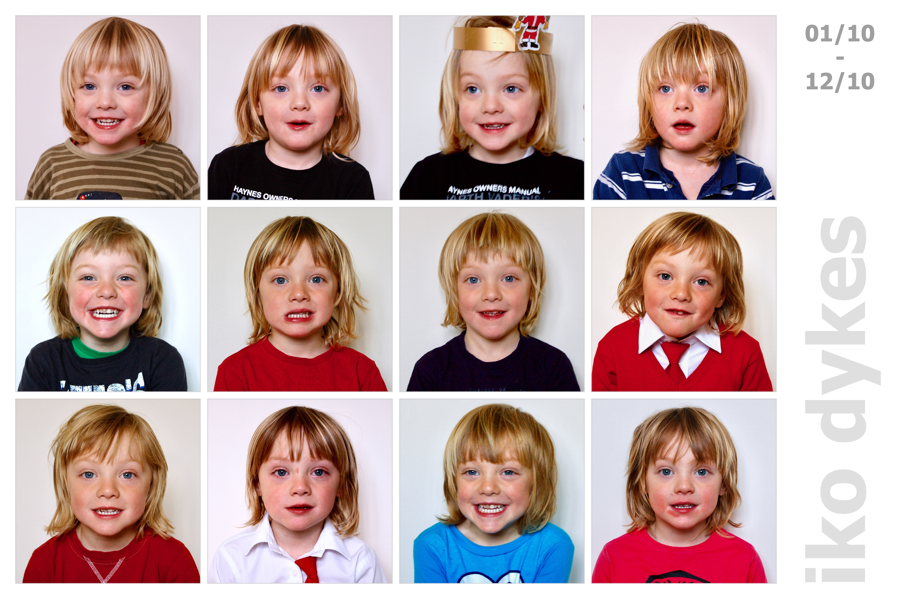

<head><title> xmas 2010 </title></head>

<link rel="stylesheet" type="text/css" href="https://jsndyks.github.io/web/css/pages.css"/>

[2023](../2023) &nbsp;&nbsp;&laquo;&nbsp;&nbsp; [2022](../2022) &nbsp;&nbsp;&laquo;&nbsp;&nbsp; [2021](../2021) &nbsp;&nbsp;&laquo;&nbsp;&nbsp; [2020](../2020) &nbsp;&nbsp;&laquo;&nbsp;&nbsp; [2019](../2019) &nbsp;&nbsp;&laquo;&nbsp;&nbsp; [2018](../2018) &nbsp;&nbsp;&laquo;&nbsp;&nbsp; [2017](../2017) &nbsp;&nbsp;&laquo;&nbsp;&nbsp; [2016](../2016) &nbsp;&nbsp;&laquo;&nbsp;&nbsp; [2015](../2015) &nbsp;&nbsp;&laquo;&nbsp;&nbsp; [2014](../2014) &nbsp;&nbsp;&laquo;&nbsp;&nbsp; [2013](../2013) &nbsp;&nbsp;&laquo;&nbsp;&nbsp; [2012](../2012) &nbsp;&nbsp;&laquo;&nbsp;&nbsp; [2011](../2011) &nbsp;&nbsp;&laquo;&nbsp;&nbsp; [2010](../2010) &nbsp;&nbsp;&laquo;&nbsp;&nbsp; [2009](../2009) &nbsp;&nbsp;&laquo;&nbsp;&nbsp; [2008](../2008) &nbsp;&nbsp;&laquo;&nbsp;&nbsp; [2007](../2007)

## xmas 2010

Our Christmas photo pack for this year ...

### Pic of The Month

Each month we take a picture to see how the boys are growing up. 
A structured record of change, or not change as they get older!

Fred and Iko are four and at school!

#### &raquo; IKO

#### &raquo; FRED

<!---

### Pics of The Year

And each year we try to find some pictures that show what we have been up to during the good times: family adventures in some of our favourite places. Holidays, weekend walks, bike rides, trips to nice places and sometimes just messing around in the garden. 
I take hundreds, thousands of photos, and try to find _a few_ that vary a little in terms of the people, times and places that are captured ...

--->

---

Jason **DYKES** 
&nbsp;&nbsp;&nbsp;&nbsp;_10/12/2023_ 
<!---  🐁 --->
<!--- update --->

