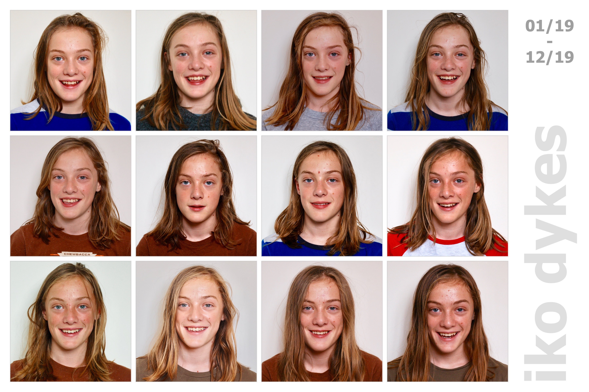

<head><title> xmas 2019 </title></head>

<link rel="stylesheet" type="text/css" href="https://jsndyks.github.io/web/css/pages.css"/>

[2023](../2023) &nbsp;&nbsp;&laquo;&nbsp;&nbsp; [2022](../2022) &nbsp;&nbsp;&laquo;&nbsp;&nbsp; [2021](../2021) &nbsp;&nbsp;&laquo;&nbsp;&nbsp; [2020](../2020) &nbsp;&nbsp;&laquo;&nbsp;&nbsp; [2019](../2019)

## xmas 2019

Our Christmas photo pack for this year ...

### Pic of The Month

Each month we take a picture to see how the kids are growing up. 
A structured record of change, or not change as they get older!

Alma and Nell are seven, Fred and Iko are teenagers.

#### &raquo; ALMA

#### &raquo; NELL

#### &raquo; IKO

#### &raquo; FRED

### Pic of The Year

And each year we try to find some pictures that show what we have been up to during the good times: family adventures in some of our favourite places. Holidays, weekend walks, bike rides, trips to nice places and sometimes just messing around in the garden. 
I take hundreds, thousands of photos, and try to limit it to _ten_ that vary a little in terms of the people, times and places  that are captured ...

  

---

### Three Peaks

You might have noticed that this year we celebrated Emma's 50th birthday by 'training' for and hiking up the three peaks.

Alma &amp; Nell didn't come to Scotland but were brilliant in ascending the monstrous Scafell Pike and the busy Yr-Wyddfa ... 

---

Jason **DYKES** 
&nbsp;&nbsp;&nbsp;&nbsp;_09/12/2023_ 
<!---  🐁 --->
<!--- update --->

