<head><title> xmas 2022 </title></head>

<link rel="stylesheet" type="text/css" href="https://jsndyks.github.io/web/css/pages.css"/>

[2023](../2023) &nbsp;&nbsp;&laquo;&nbsp;&nbsp; [2022](../2022) &nbsp;&nbsp;&laquo;&nbsp;&nbsp; [2021](../2021) &nbsp;&nbsp;&laquo;&nbsp;&nbsp; [2020](../2020)

## xmas 2022

Our Christmas photo pack for this year ...

### Pic of The Month

Each month we take a picture to see how the kids are growing up. 
A structured record of change, or not change as they get older!

Alma and Nell are now into double figures, Fred and Brook are 16 and starting A-levels.

#### &raquo; ALMA

<a href="./alma22-3600x2400.jpg">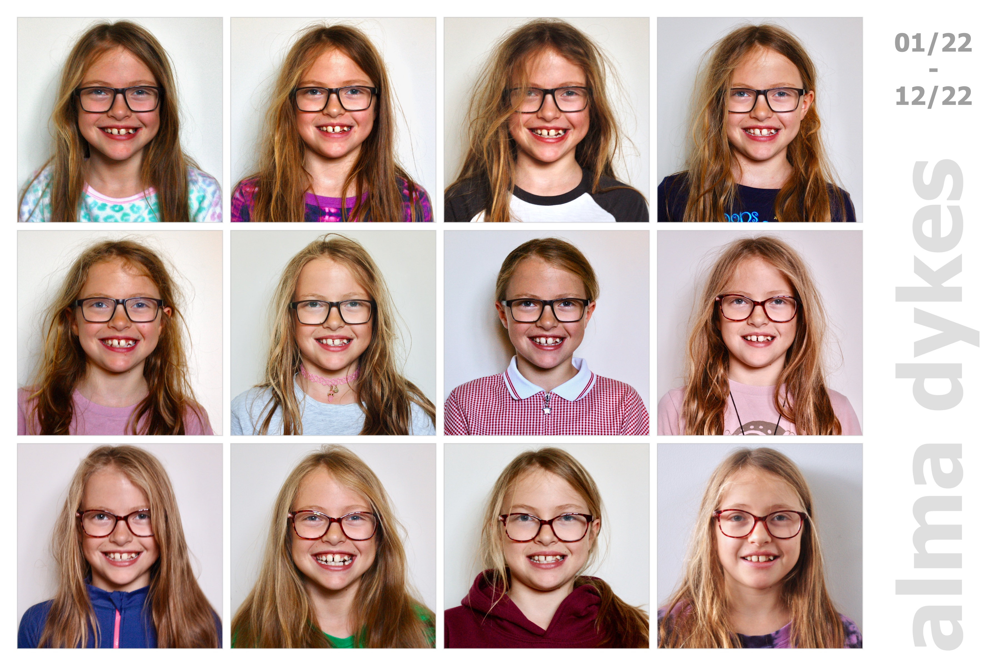</a>

#### &raquo; NELL

<a href="./nell22-3600x2400.jpg">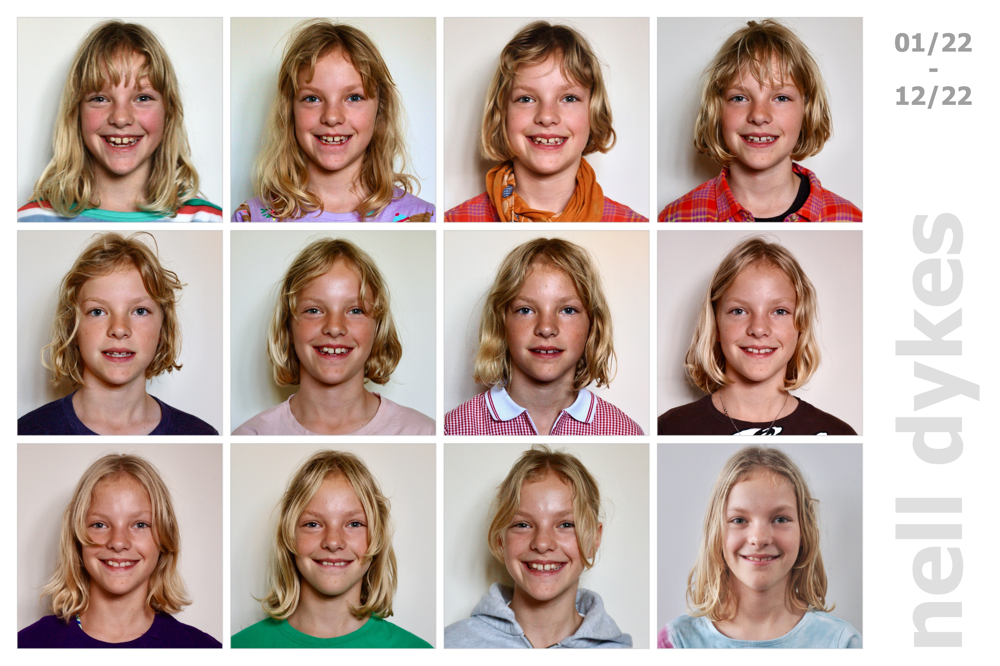</a>

#### &raquo; BROOK

<a href="./brook22-3600x2400.jpg">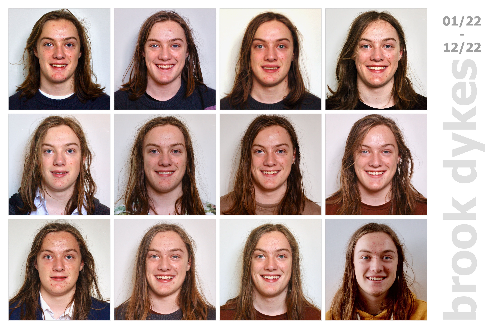</a>

#### &raquo; FRED

<a href="./fred22-3600x2400.jpg">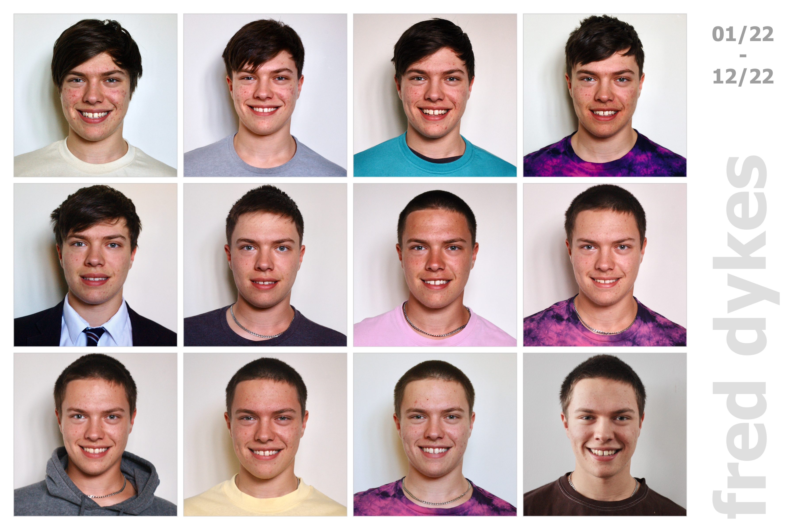</a>

### Pic of The Year

And each year we try to find some pictures that show what we have been up to during the good times: family adventures in some of our favourite places. Holidays, weekend walks, bike rides, trips to nice places and sometimes just messing around in the garden. 
I take hundreds, thousands of photos, and try to limit it to _ten_ that vary a little in terms of the people, times and places  that are captured ...

<a href="xmas2022.allFour.alma.jpg">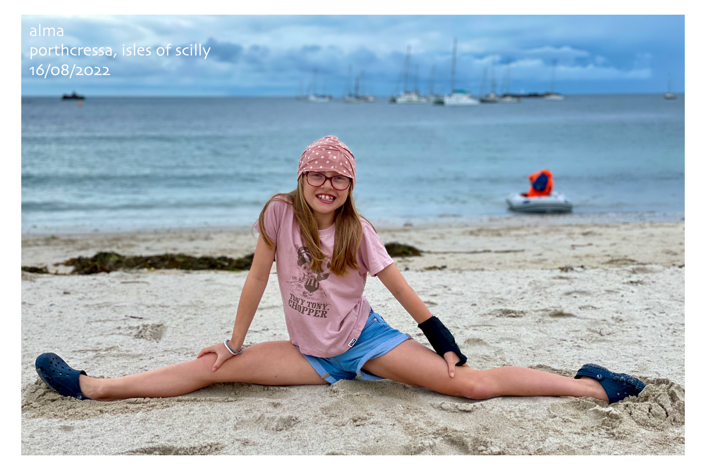</a>

<a href="xmas2022.allFour.brook.jpg">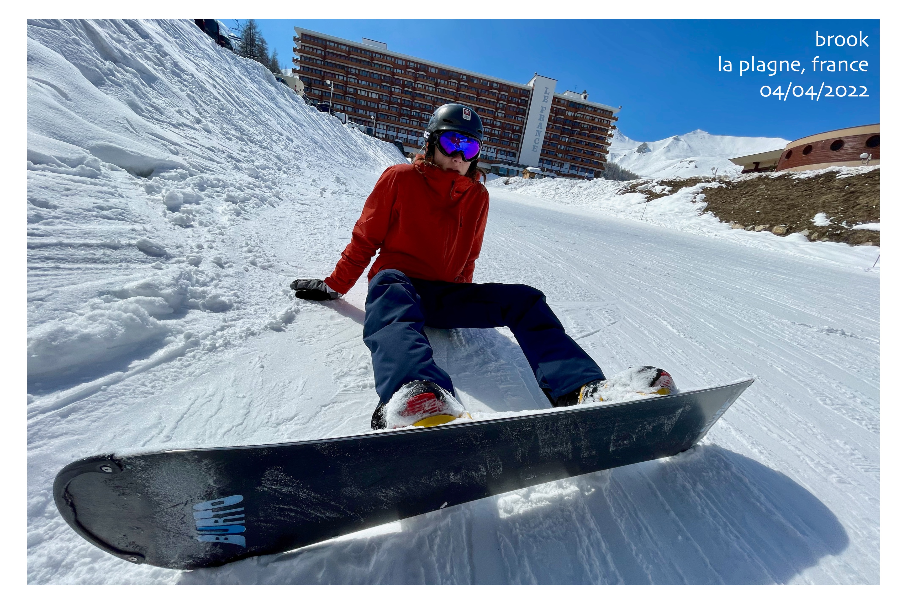</a>

<a href="xmas2022.allFour.fred.jpg">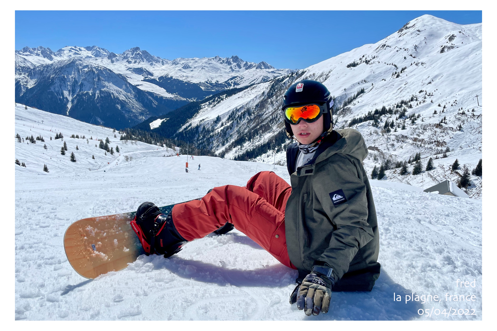</a>

<a href="xmas2022.allFour.nell.jpg">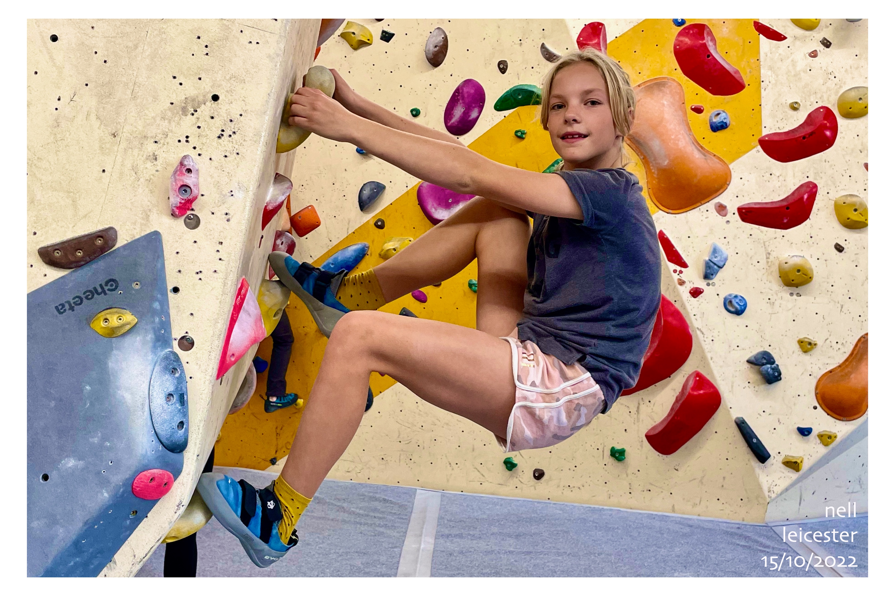</a>

<a href="xmas2022.allFour.borthygest.jpg">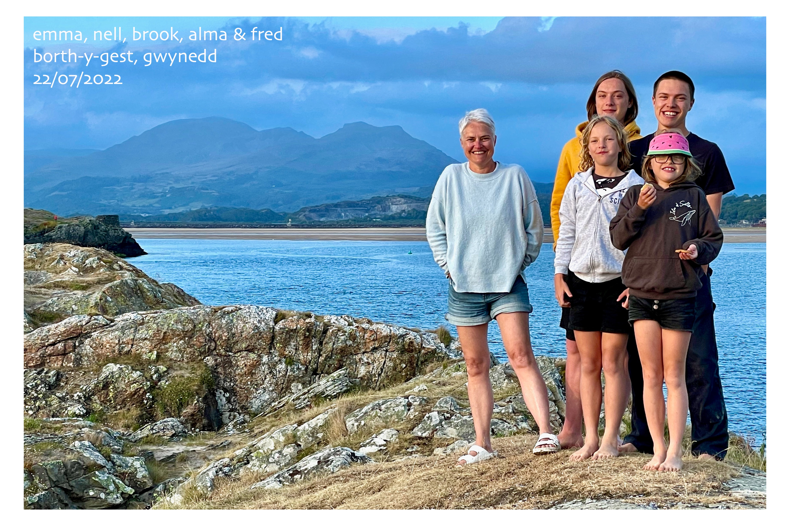</a>

<a href="xmas2022.allFour.cricket.jpg">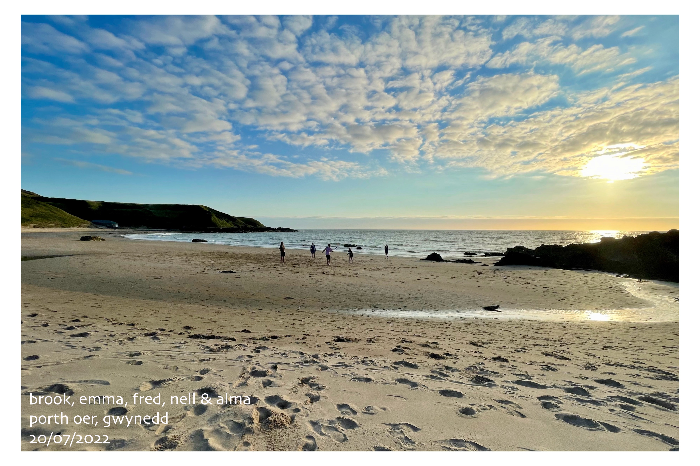</a>

<a href="xmas2022.allFour.fredAndBrook.jpg">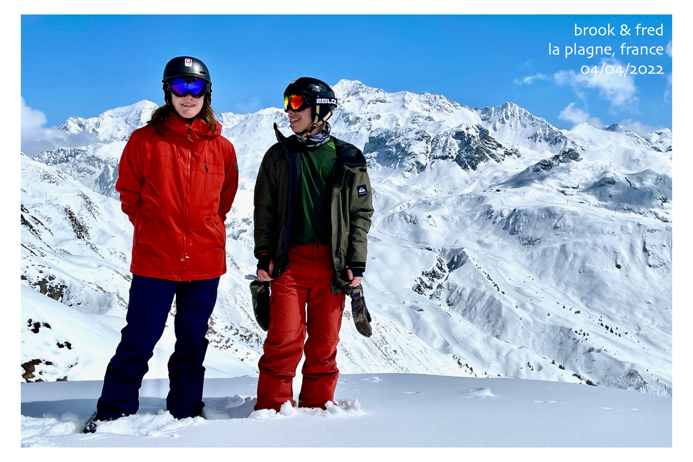</a>

<a href="xmas2022.allFour.birmingham.jpg">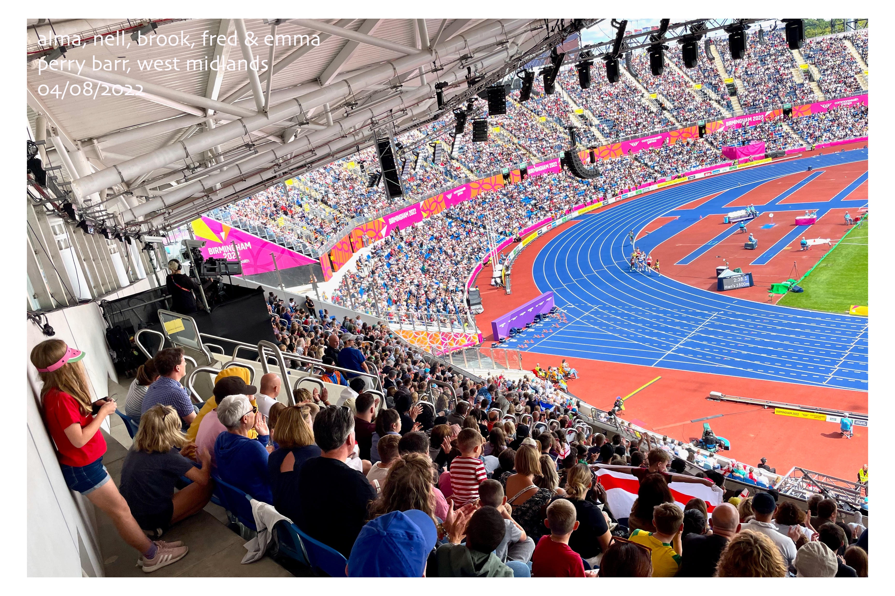</a>

<a href="xmas2022.allFour.kayaks.jpg">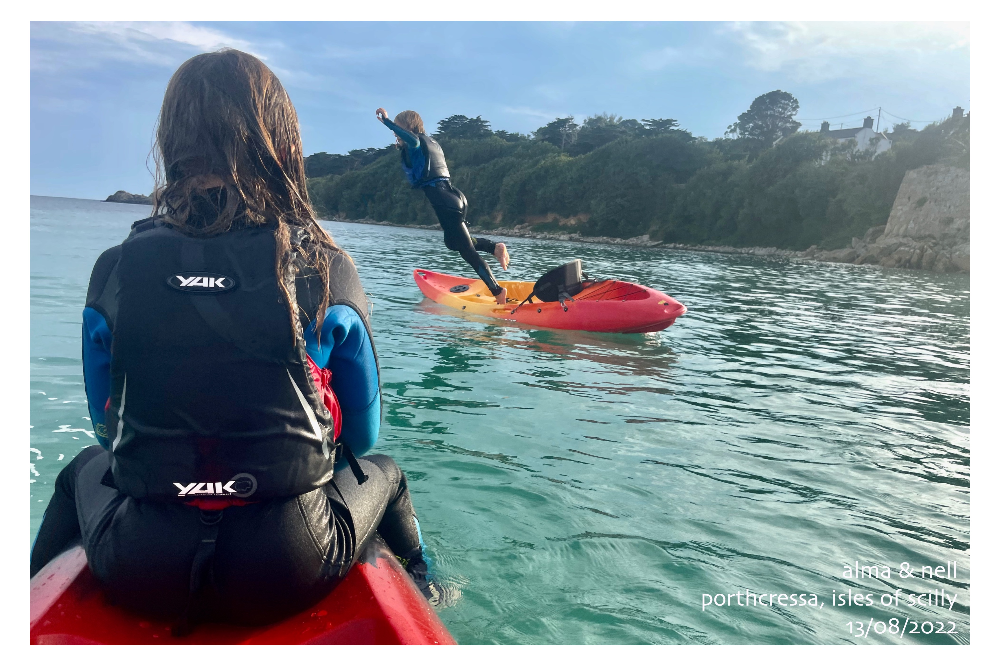</a>

<a href="xmas2022.allFour.nornour.jpg">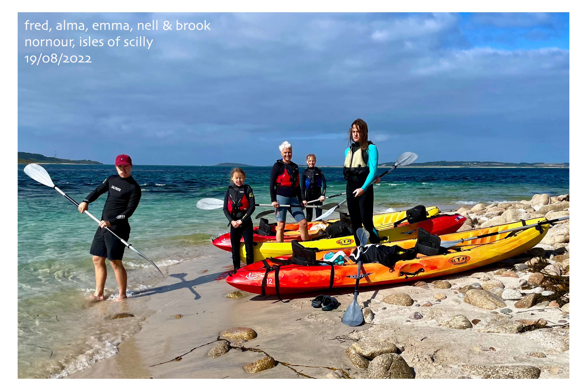</a>

---

Jason **DYKES** 
&nbsp;&nbsp;&nbsp;&nbsp;_09/12/2023_ 
<!---  🐁 --->
<!--- update --->

