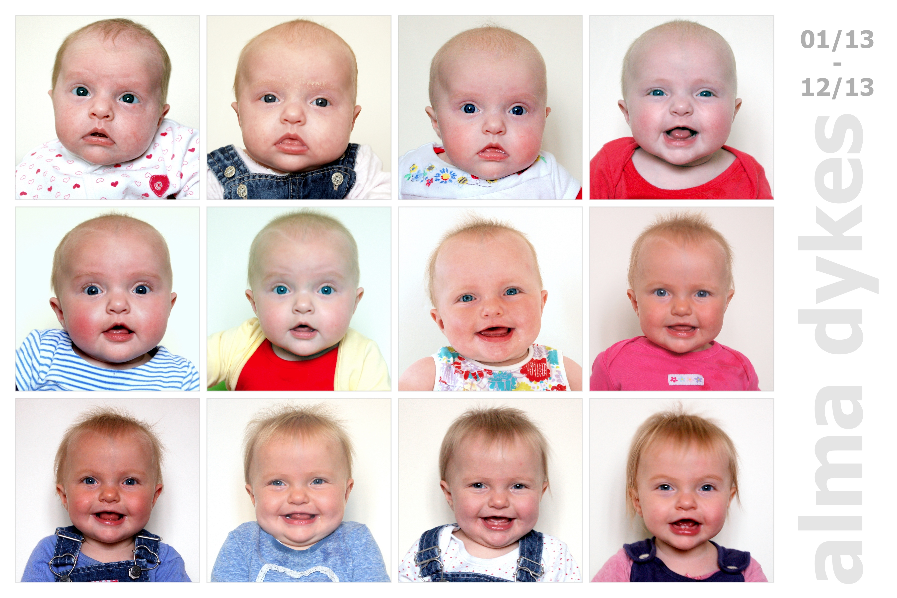
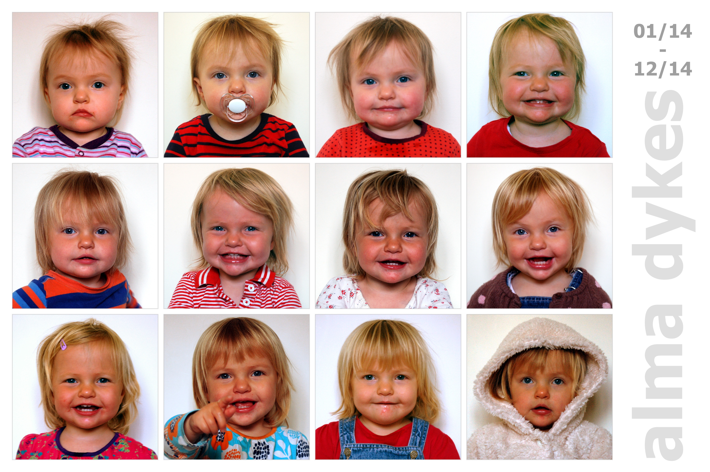
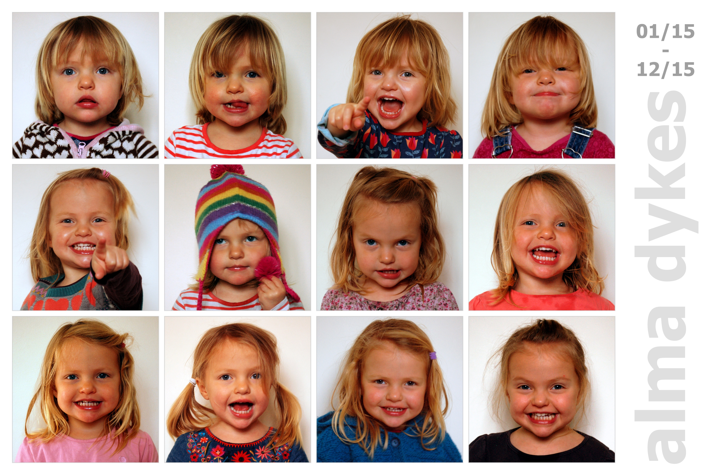
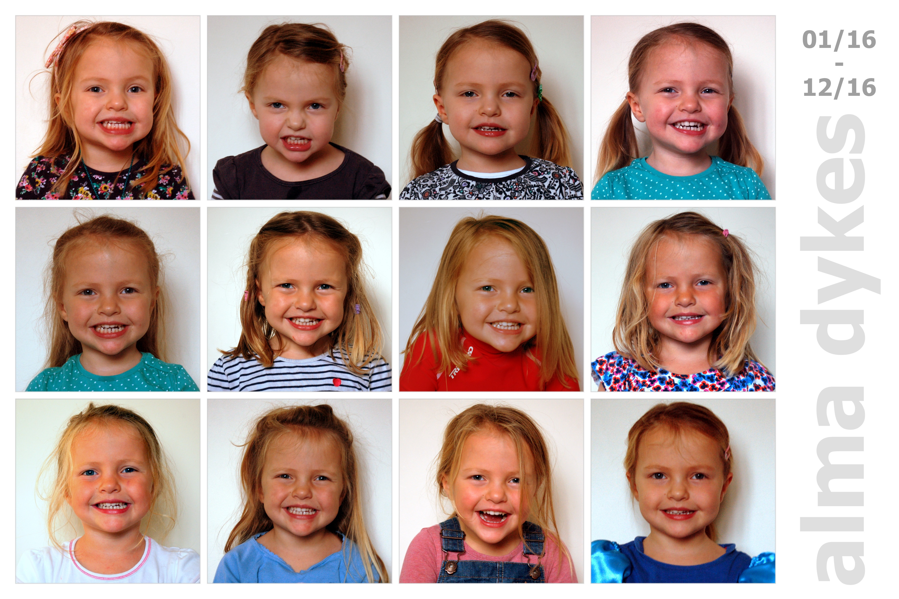
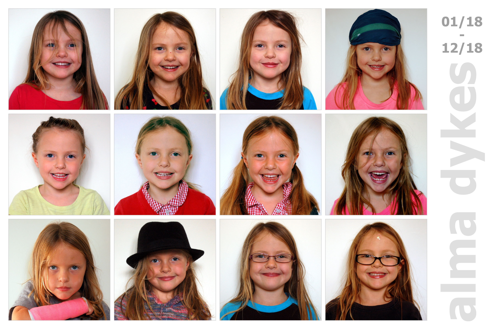
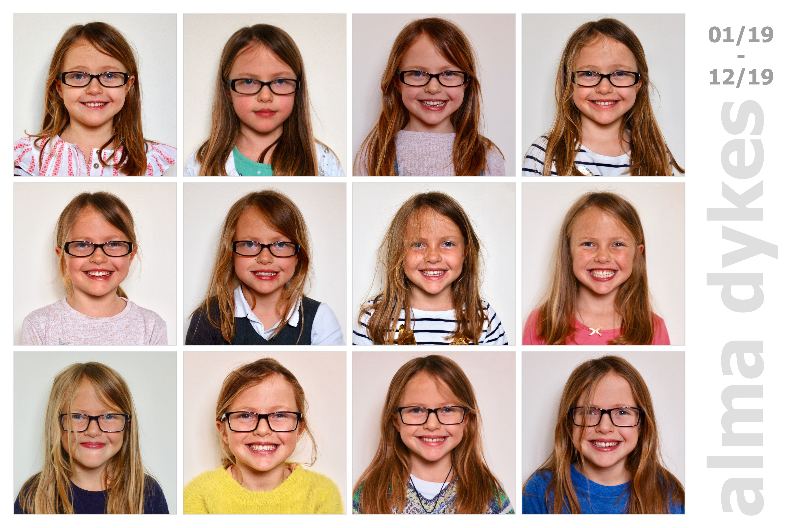
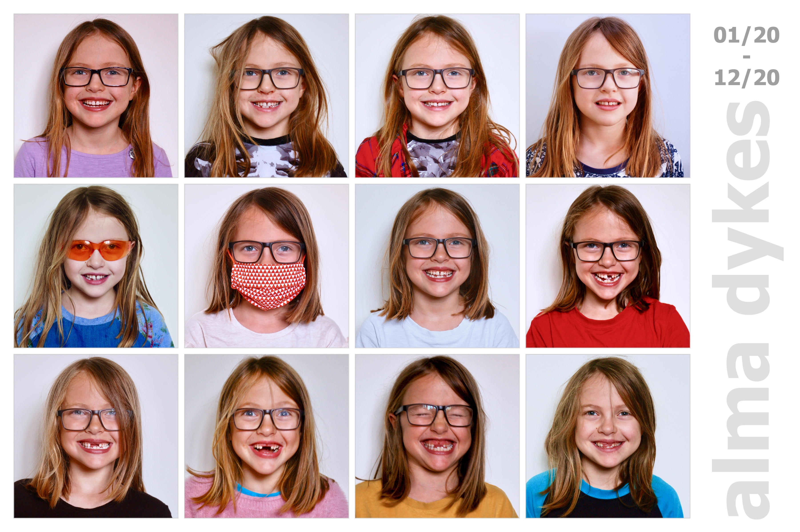
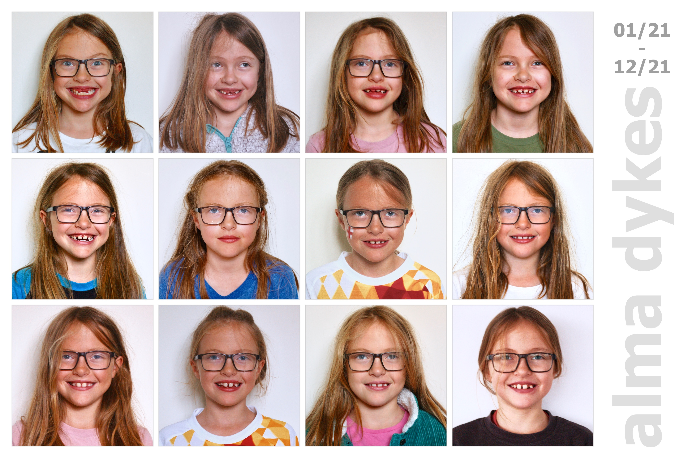
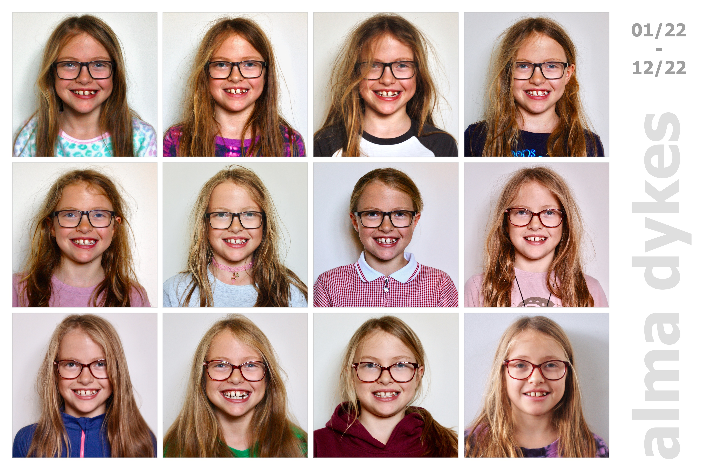
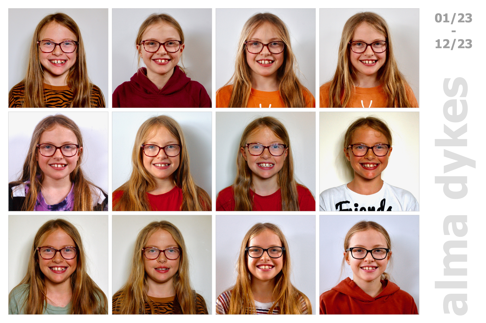

<head><title> alma </title></head>

<link rel="stylesheet" type="text/css" href="https://jsndyks.github.io/web/css/pages.css"/>

## alma

---

Jason **DYKES** 
&nbsp;&nbsp;&nbsp;&nbsp;_19/12/2023_ 
<!---  🐁 --->
<!--- update --->

