<head><title> fred </title></head>

<link rel="stylesheet" type="text/css" href="https://jsndyks.github.io/web/css/pages.css"/>

[2023](../2023) &nbsp;&nbsp;&laquo;&nbsp;&nbsp; [2022](../2022) &nbsp;&nbsp;&laquo;&nbsp;&nbsp; [2021](../2021) &nbsp;&nbsp;&laquo;&nbsp;&nbsp; [2020](../2020) &nbsp;&nbsp;&laquo;&nbsp;&nbsp; [2019](../2019) &nbsp;&nbsp;&laquo;&nbsp;&nbsp; [2018](../2018) &nbsp;&nbsp;&laquo;&nbsp;&nbsp; [2017](../2017) &nbsp;&nbsp;&laquo;&nbsp;&nbsp; [2016](../2016) &nbsp;&nbsp;&laquo;&nbsp;&nbsp; [2015](../2015) &nbsp;&nbsp;&laquo;&nbsp;&nbsp; [2014](../2014) &nbsp;&nbsp;&laquo;&nbsp;&nbsp; [2013](../2013) &nbsp;&nbsp;&laquo;&nbsp;&nbsp; [2012](../2012) &nbsp;&nbsp;&laquo;&nbsp;&nbsp; [2011](../2011) &nbsp;&nbsp;&laquo;&nbsp;&nbsp; [2010](../2010) &nbsp;&nbsp;&laquo;&nbsp;&nbsp; [2009](../2009) &nbsp;&nbsp;&laquo;&nbsp;&nbsp; [2008](../2008) &nbsp;&nbsp;&laquo;&nbsp;&nbsp; [2007](../2007) &nbsp;&nbsp;&laquo;&nbsp;&nbsp; [2006](../2006) 
 [alma](../alma) &nbsp;&nbsp;&laquo;&nbsp;&nbsp; [brook](../brook) &nbsp;&nbsp;&laquo;&nbsp;&nbsp; [fred](../fred) &nbsp;&nbsp;&laquo;&nbsp;&nbsp; [nell](../nell) 

## fred

<a href="../2006/fred06-3600x2400.jpg">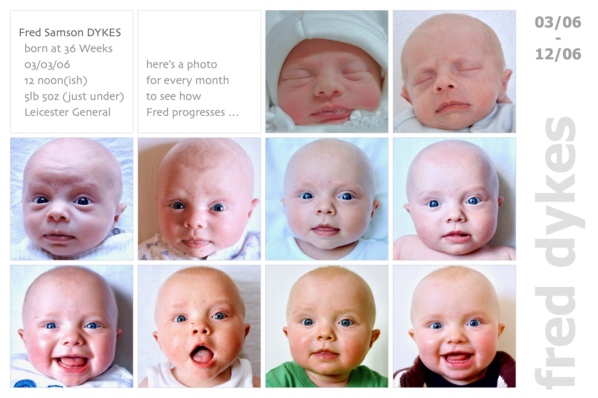</a>

<a href="../2007/fred07-3600x2400.jpg">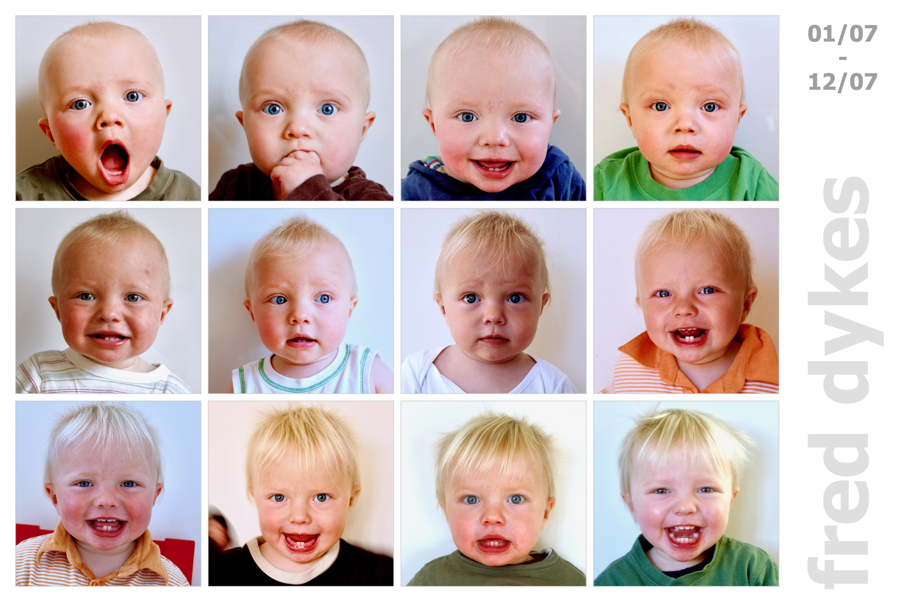</a>

<a href="../2008/fred08-3600x2400.jpg">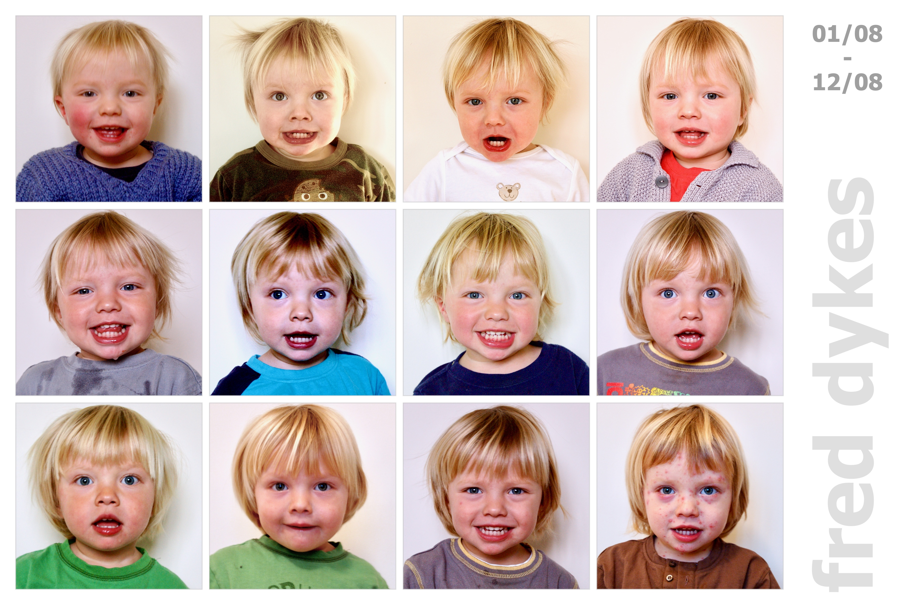</a>

<a href="../2009/fred09-3600x2400.jpg">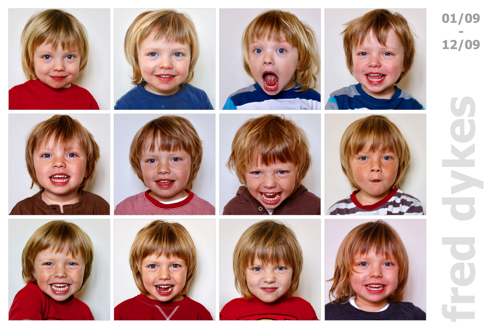</a>

<a href="../2010/fred10-3600x2400.jpg">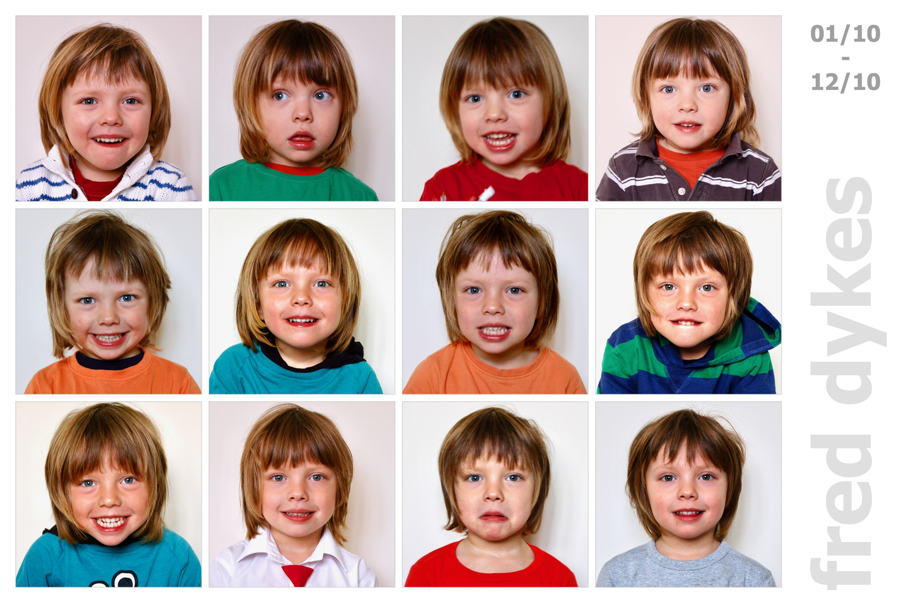</a>

<a href="../2011/fred11-3600x2400.jpg">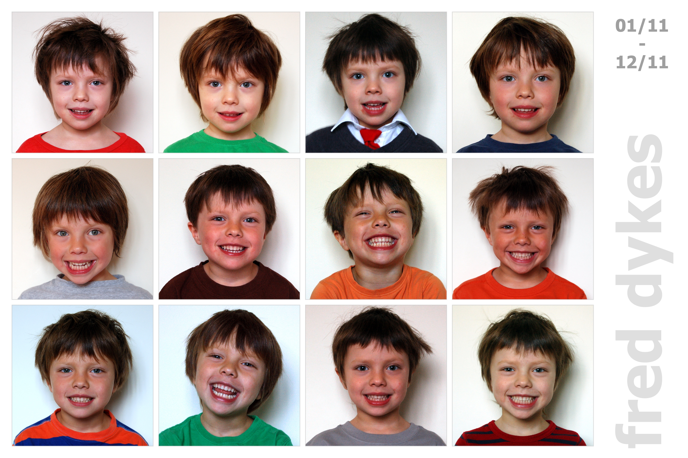</a>

<a href="../2012/fred12-3600x2400.jpg">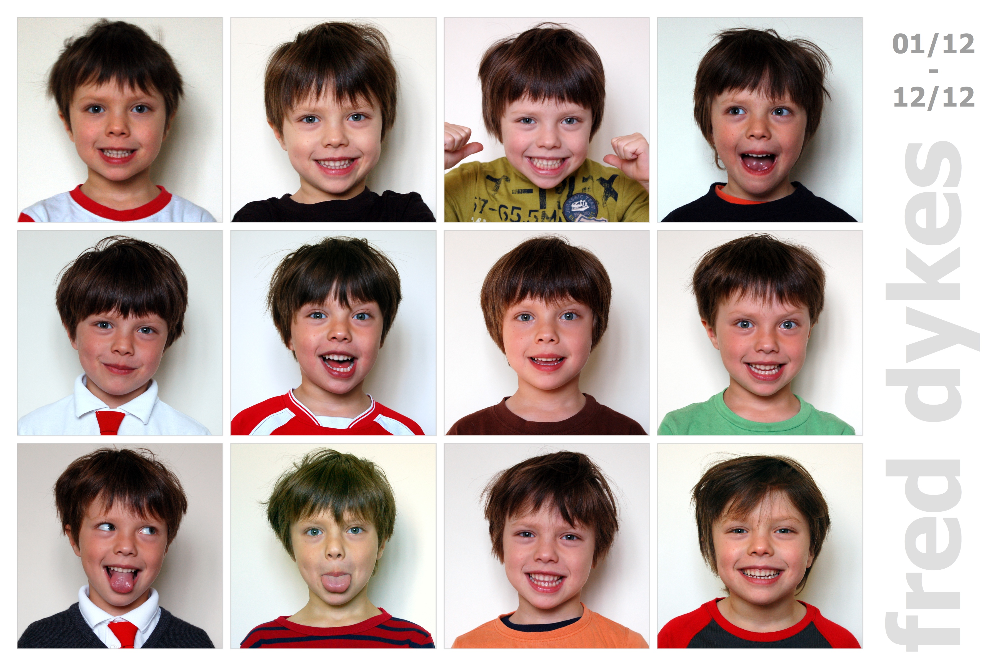</a>

<a href="../2013/fred13-3600x2400.jpg">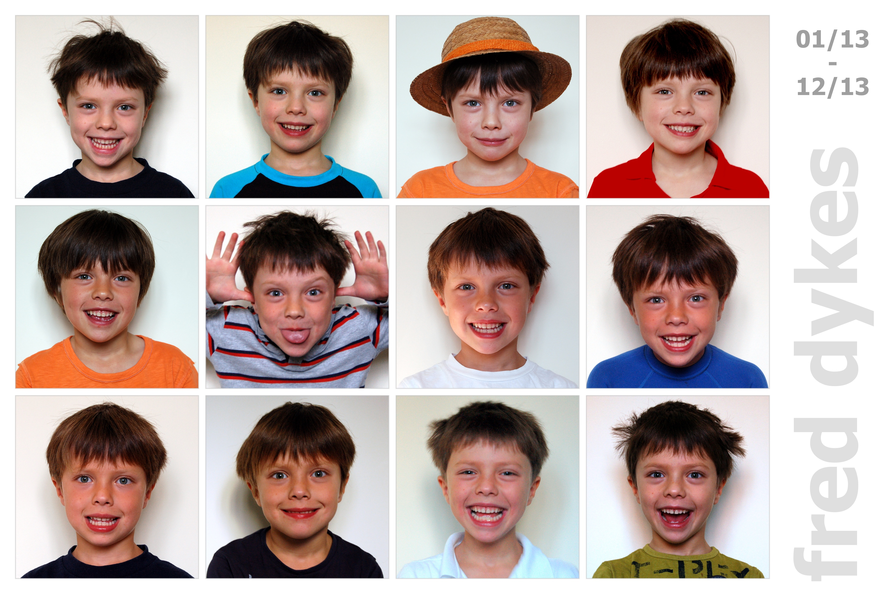</a>

<a href="../2014/fred14-3600x2400.jpg">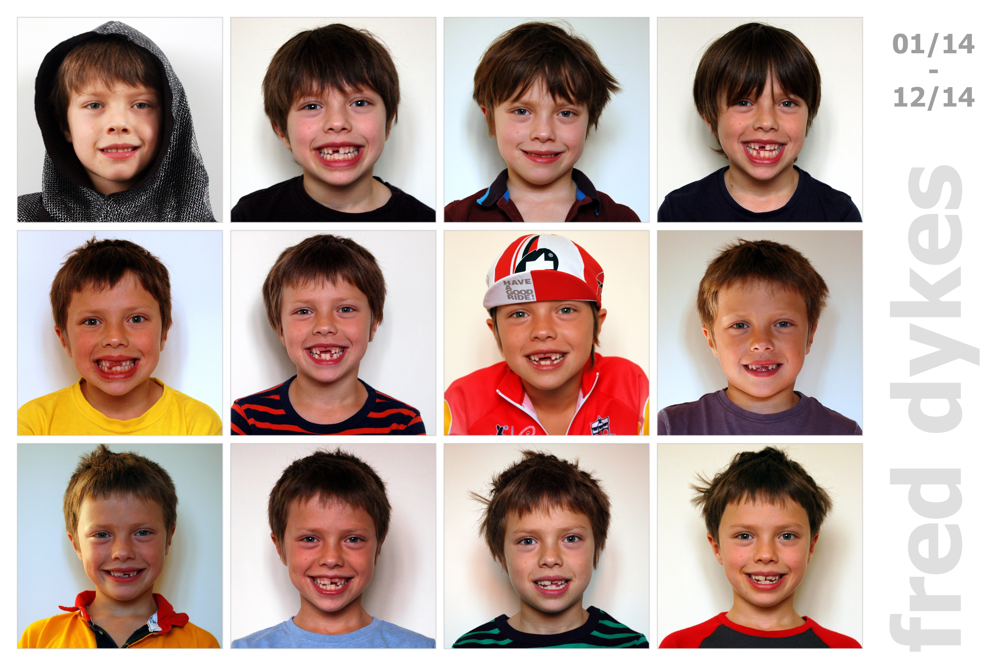</a>

<a href="../2015/fred15-3600x2400.jpg">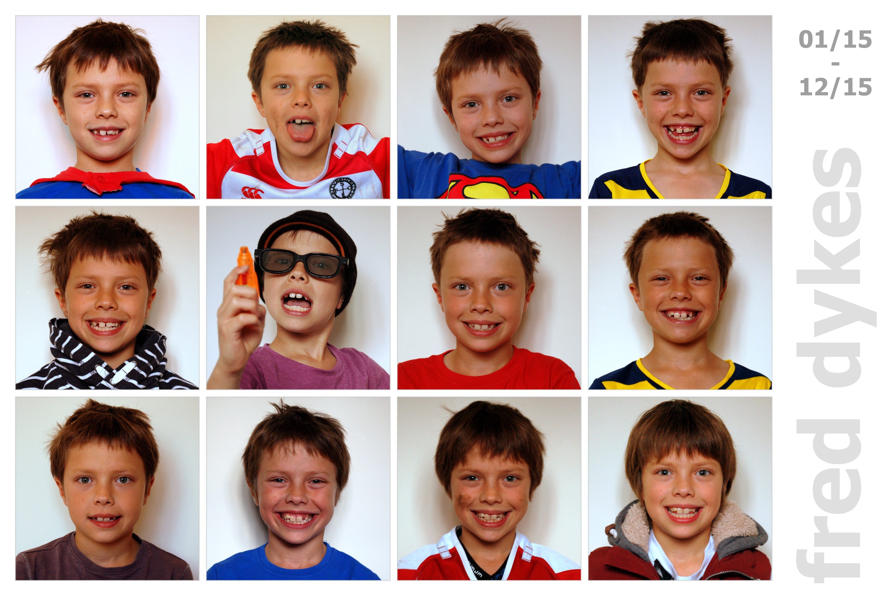</a>

<a href="../2016/fred16-3600x2400.jpg">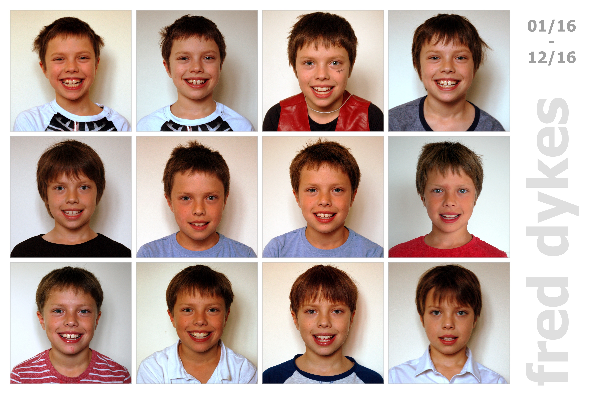</a>

<a href="../2018/fred18-3600x2400.jpg">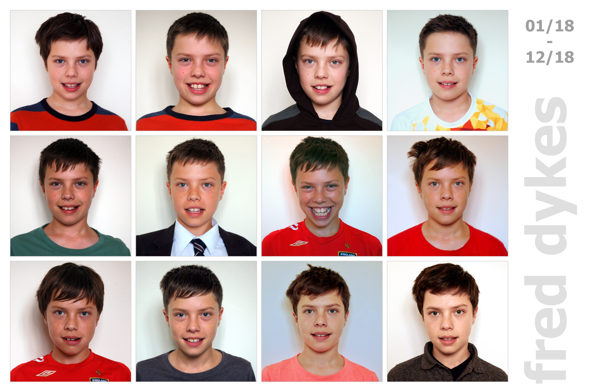</a>

<a href="../2021/fred21-3600x2400.jpg">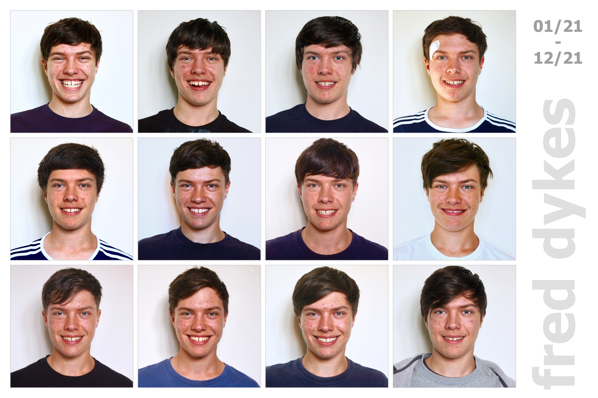</a>

<a href="../2022/fred22-3600x2400.jpg">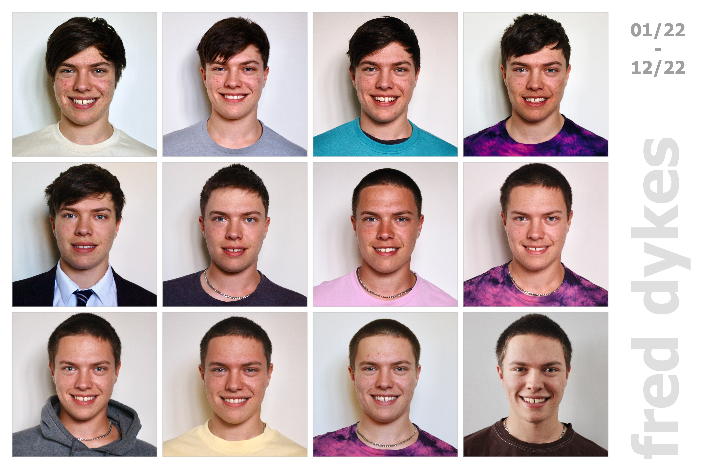</a>

<a href="../2023/fred23-3600x2400.jpg">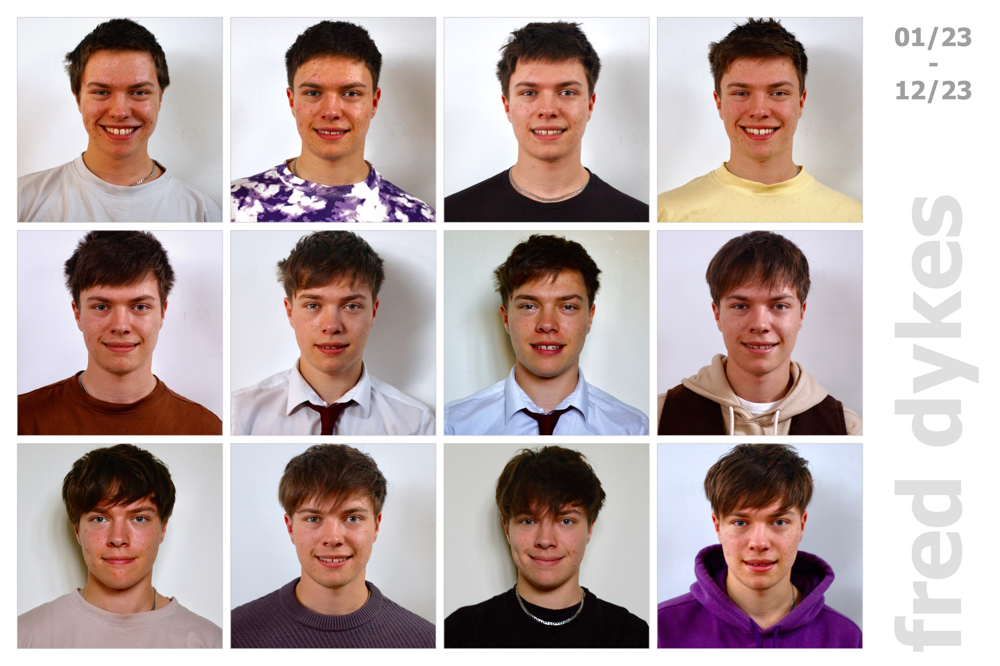</a>

---

Jason **DYKES** 
&nbsp;&nbsp;&nbsp;&nbsp;_19/12/2023_ 
<!---  🐁 --->
<!--- update --->

